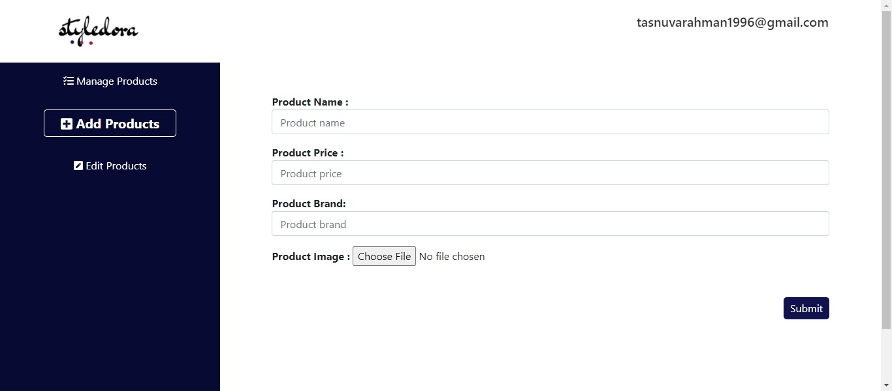

# Full Stack project-StyleDora website
Wesite link : https://full-stack-client.web.app

A web  application created with html,css,javascript,react,react-bootstrap,node js,express js,mongodb.

## Features
StyleDora is an e-commerce website that sells T-shirts.On the home page visitors can see different products ,can place orders,review orders .Admins of this website can add new products,delete and update them.It has custom api and database.The website is responsive for large medium and small screen.

## Tech/framework used

<b>Built with</b>

* html
* css
* javascript
* react
* react-router
* react-bootstrap
* node js
* express js
* mongodb
* firebase
* heroku
 
## Screenshots

## Installation and Setup Instructions

Clone down this repository. You will need `node` and `npm` installed globally on your machine.  

Installation:

`npm install`  

To Run Test Suite:  

`npm test`  

To Start Server:

`npm start`  

To Visit App:

`localhost:3000/ideas` 

## API Reference

API link : https://apple-sundae-80140.herokuapp.com

## How to use 

* Go to the website ***home*** to view different products,their images,name,price and brand
* Click on the ***Buy Now*** button to place order of the product
* if you are not logged in already ,Please ***Log in*** to place order.
* if you are logged in in will take you directly to ***check out*** page .Where you can check out the order of that product.
* On the navbar click on the ***Orders*** link to see and review all the order you have placed so far.You can delete orders by clicking ***Cancel*** button.
* On the ***Admin*** page you will have three options to **Manage Product**,**Add Product** and **Edit Product**.
* To see recent deals please visit the deals page .

## Credits
I have done this project as an assignment of programming hero web development course. Most of the technologies I have used here is taught by our respectable instructor Jhankar Mahbub.

## License

© [Tasnuva Rahman](https://github.com/tasnuvatina)